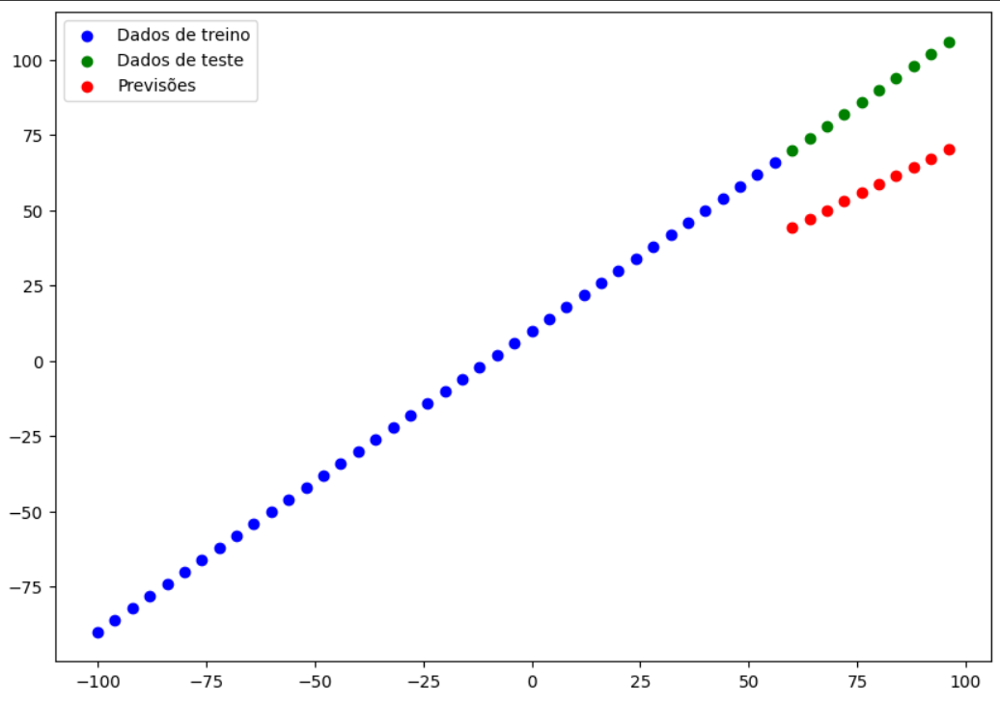
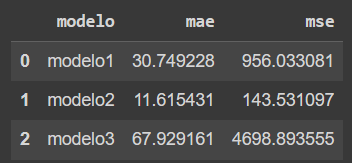

# Treinamento de Modelos de Regressão Linear Simples

  
  

Este README fornece uma visão geral do código e das etapas envolvidas no treinamento de modelos de regressão linear simples usando a biblioteca TensorFlow em Python. O código inclui a criação de três modelos, treinamento, avaliação e a comparação de suas métricas de erro (Mean Absolute Error - MAE e Mean Squared Error - MSE). Além disso, um dos modelos é salvo em um formato chamado "SavedModel".

## Visão Geral do Código
- O código é dividido em várias seções, com comentários para explicar cada parte do processo.

### Bibliotecas Utilizadas
- tensorflow é importado para criar e treinar os modelos de regressão linear.
- matplotlib.pyplot é utilizado para visualizar os dados e as previsões.
- numpy é utilizado para criar os dados de entrada e rótulos.
- pandas é usado para analisar e apresentar os resultados dos modelos.
### Criação do Conjunto de Dados
- Um conjunto de dados é gerado com valores de entrada x no intervalo de -100 a 100 (de 4 em 4) e seus rótulos correspondentes y são criados como x + 10.
### Divisão em Dados de Treino e Teste
- O conjunto de dados é dividido em dados de treino (x_treino e y_treino) e dados de teste (x_teste e y_teste) para avaliar o desempenho dos modelos.
### Visualização dos Dados
- Um gráfico é gerado para visualizar os dados de treino (em azul) e os dados de teste (em verde).
### Funções de Avaliação
- Duas funções, mae (Mean Absolute Error) e mse (Mean Squared Error), são definidas para calcular as métricas de erro MAE e MSE.
### Construção dos Modelos
- Três modelos de regressão linear são construídos, cada um com uma ou duas camadas de neurônios.
### Treinamento dos Modelos
- Os modelos são compilados com a função de perda MAE (Mean Absolute Error) e o otimizador SGD (Stochastic Gradient Descent). Eles são então treinados com os dados de treino.
### Geração de Previsões
- Previsões são feitas utilizando os dados de teste e os modelos treinados.
### Visualização das Previsões
- Gráficos são gerados para comparar as previsões dos modelos com os dados reais de treino e teste.

### Avaliação dos Modelos
- As métricas MAE e MSE são calculadas para avaliar o desempenho de cada modelo.

### Resultados Finais

- Os resultados são armazenados em um DataFrame do Pandas, que inclui o nome do modelo, o MAE e o MSE.
- Os resultados são exibidos como uma tabela no final do código.

### Salvando um Modelo
- Um dos modelos treinados é salvo em um formato chamado "SavedModel" com o nome "melhor_modeloSavedModel_format".
### Uso do Código
- Você pode executar este código para treinar modelos de regressão linear simples, avaliá-los e compará-los com base nas métricas MAE e MSE. Os resultados são exibidos no final e podem ser úteis para selecionar o modelo mais adequado para o seu problema.

* Certifique-se de que as bibliotecas necessárias, como TensorFlow, estejam instaladas em seu ambiente antes de executar o código. Além disso, o modelo "melhor_modeloSavedModel_format" é salvo no diretório de trabalho atual.

Espero que este README tenha sido útil para entender o código e seu propósito. Boa sorte com o treinamento de seus modelos de regressão linear!
